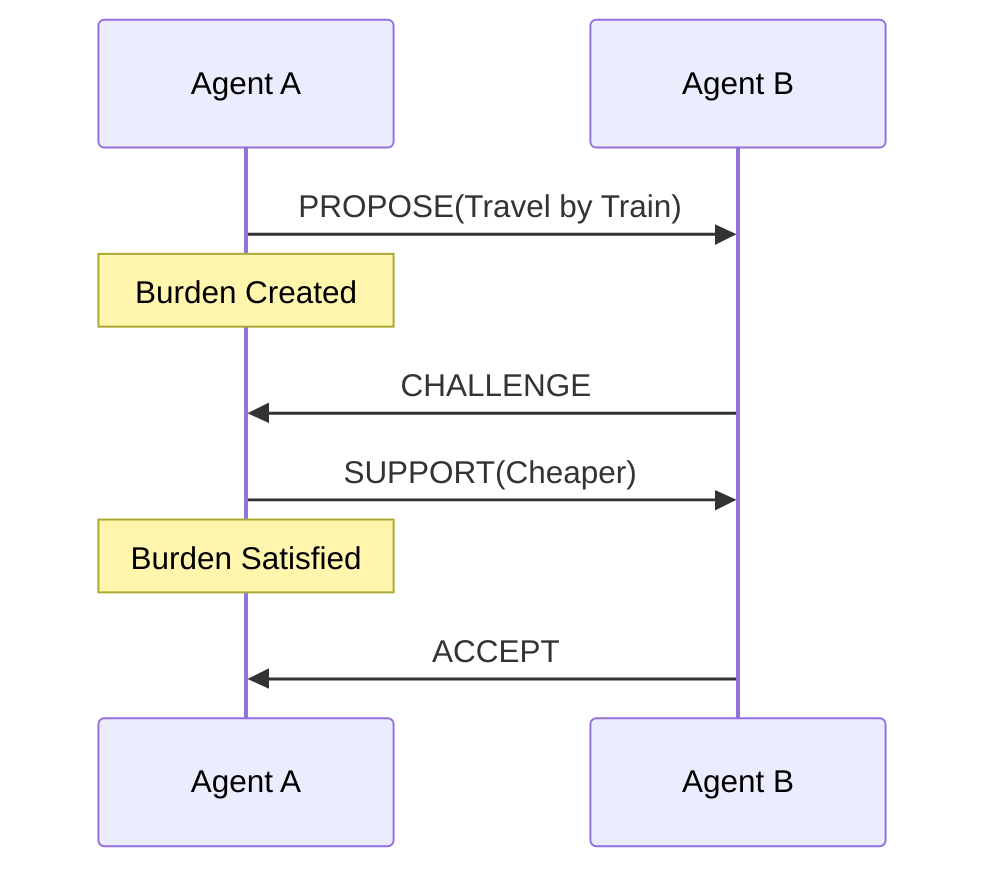

```mermaid
sequenceDiagram

participant A as Agent A
participant B as Agent B

A->>B: PROPOSE(Travel by Train)

Note over A: Burden Created

B->>A: CHALLENGE

A->>B: SUPPORT(Cheaper)

Note over A: Burden Satisfied

B->>A: ACCEPT
```