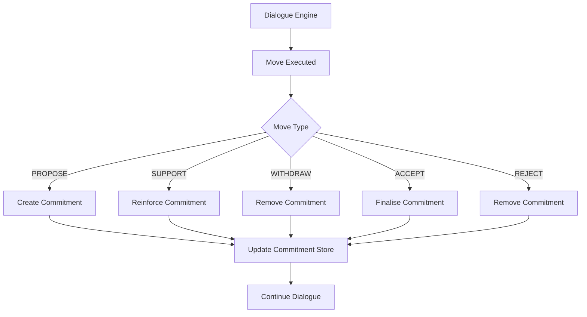

```mermaid
flowchart TD

A[Dialogue Engine] --> B[Move Executed]

B --> C{Move Type}

C --> |PROPOSE| D[Create Commitment]

C --> |SUPPORT| E[Reinforce Commitment]

C --> |WITHDRAW| F[Remove Commitment]

C --> |ACCEPT| G[Finalise Commitment]

C --> |REJECT| H[Remove Commitment]

D --> I[Update Commitment Store]
E --> I
F --> I
G --> I
H --> I

I --> J[Continue Dialogue]
```

