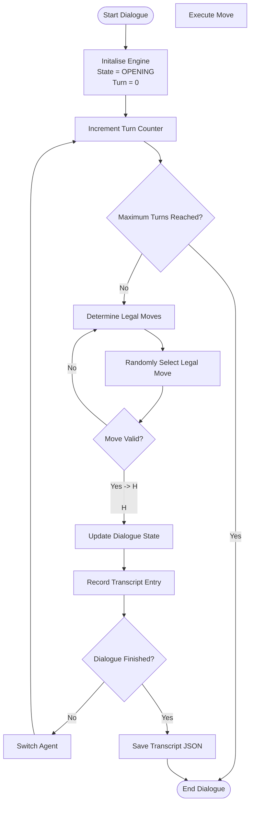

```mermaid
flowchart TD

    A([Start Dialogue])

    B[Initalise Engine<br/>State = OPENING<br/>Turn = 0]

    C[Increment Turn Counter]

    D{Maximum Turns Reached?}

    E[Determine Legal Moves]

    F[Randomly Select Legal Move]

    G{Move Valid?}

    H[Execute Move]

    I[Update Dialogue State]

    J[Record Transcript Entry]

    K{Dialogue Finished?}

    L[Switch Agent]

    M([End Dialogue])

    N[Save Transcript JSON]

    A --> B
    B --> C
    C --> D

    D -- No --> E
    D -- Yes --> M

    E --> F
    F --> G

    G -- No --> E
    G -- Yes -> H

    H --> I
    I --> J
    J --> K

    K -- No --> L
    L --> C

    K -- Yes --> N
    N --> M
```

