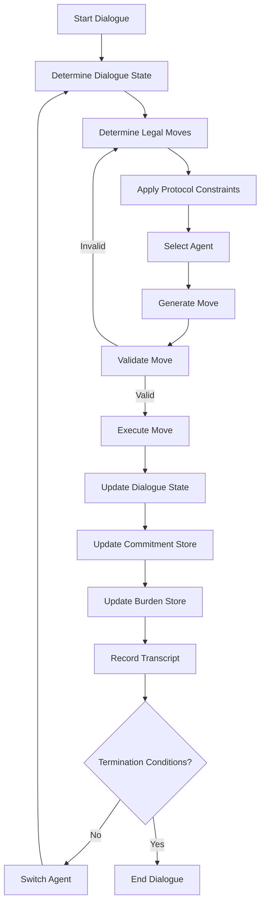

```mermaid
flowchart TD

    A[Start Dialogue]

    A --> B[Determine Dialogue State]

    B --> C[Determine Legal Moves]

    C --> D[Apply Protocol Constraints]

    D --> E[Select Agent]

    E --> F[Generate Move]

    F --> G[Validate Move]

    G --> |Invalid| C

    G --> |Valid| H[Execute Move]

    H --> I[Update Dialogue State]

    I --> J[Update Commitment Store]

    J --> K[Update Burden Store]

    K --> L[Record Transcript]

    L --> M{Termination Conditions?}

    M --> |No| N[Switch Agent]

    N --> B

    M --> |Yes| O[End Dialogue]
```

