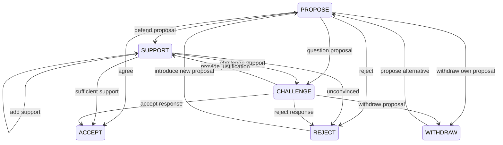

```mermaid
stateDiagram-v2

    state "PROPOSE" as P
    state "SUPPORT" as S
    state "CHALLENGE" as C
    state "ACCEPT" as A
    state "REJECT" as R
    state "WITHDRAW" as W

    P --> S : defend proposal
    P --> C : question proposal
    P --> A : agree
    P --> R : reject
    P --> W : withdraw own proposal

    S --> S : add support
    S --> C : challenge support
    S --> A : sufficient support
    S --> R : unconvinced

    C --> S : provide justification
    C --> W : withdraw proposal
    C --> A : accept response
    C --> R : reject response

    R --> P : introduce new proposal

    W --> P : propose alternative
```