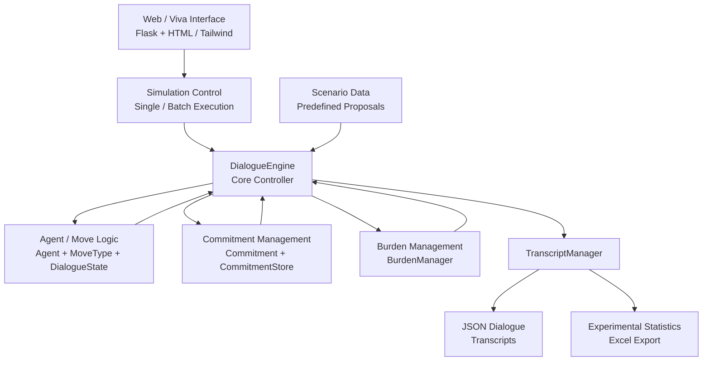

```mermaid
flowchart TD

    UI["Web / Viva Interface<br/>Flask + HTML / Tailwind"]
    SC["Simulation Control<br/>Single / Batch Execution"]

    DE["DialogueEngine<br/>Core Controller"]

    SD["Scenario Data<br/>Predefined Proposals"]
    AG["Agent / Move Logic<br/>Agent + MoveType + DialogueState"]
    CS["Commitment Management<br/>Commitment + CommitmentStore"]
    BM["Burden Management<br/>BurdenManager"]

    TM["TranscriptManager"]

    JSON["JSON Dialogue<br/>Transcripts"]
    EX["Experimental Statistics<br/>Excel Export"]

    UI --> SC
    SC --> DE

    SD --> DE

    DE --> AG
    DE --> CS
    DE --> BM

    AG --> DE
    CS --> DE
    BM --> DE

    DE --> TM

    TM --> JSON
    TM --> EX
```