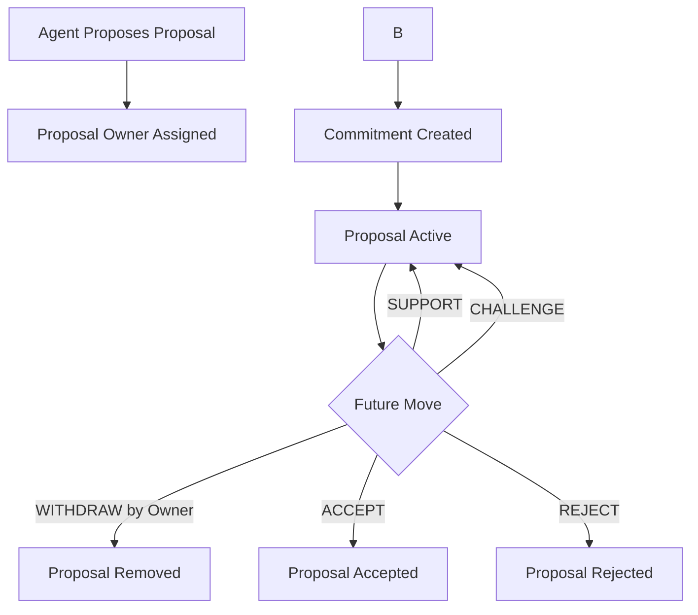

```mermaid
flowchart TD

A[Agent Proposes Proposal]

A --> M[Proposal Owner Assigned]

B --> C[Commitment Created]

C --> D[Proposal Active]

D --> E{Future Move}

E --> |SUPPORT| D

E --> |CHALLENGE| D

E --> |WITHDRAW by Owner| F[Proposal Removed]

E --> |ACCEPT| G[Proposal Accepted]

E --> |REJECT| H[Proposal Rejected]
```