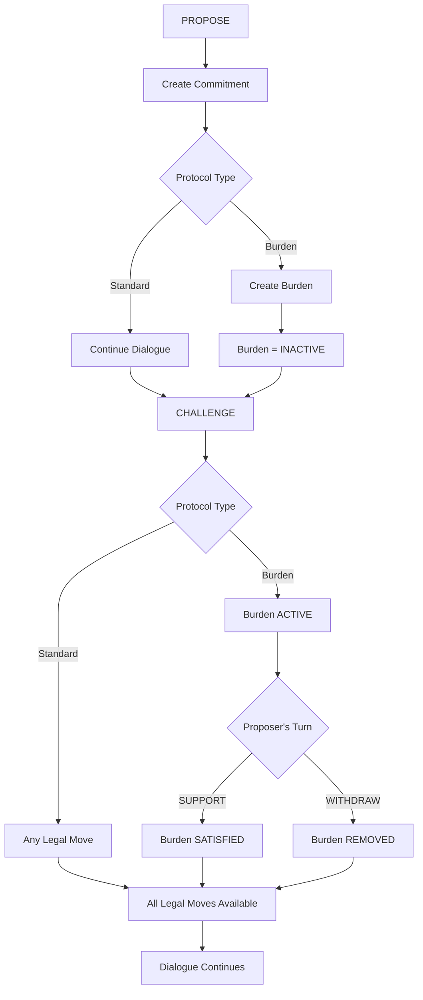

```mermaid
flowchart TD

    A[PROPOSE]

    A --> B[Create Commitment]

    B --> C{Protocol Type}

    C --> |Standard| D[Continue Dialogue]

    C --> |Burden| E[Create Burden]

    E --> F[Burden = INACTIVE]

    D --> G[CHALLENGE]

    F --> G

    G --> H{Protocol Type}

    H --> |Standard| I[Any Legal Move]

    H --> |Burden| J[Burden ACTIVE]

    J --> K{Proposer's Turn}

    K --> |SUPPORT| L[Burden SATISFIED]

    K --> |WITHDRAW| M[Burden REMOVED]

    L --> N[All Legal Moves Available]

    I --> N

    M --> N

    N --> O[Dialogue Continues]
```