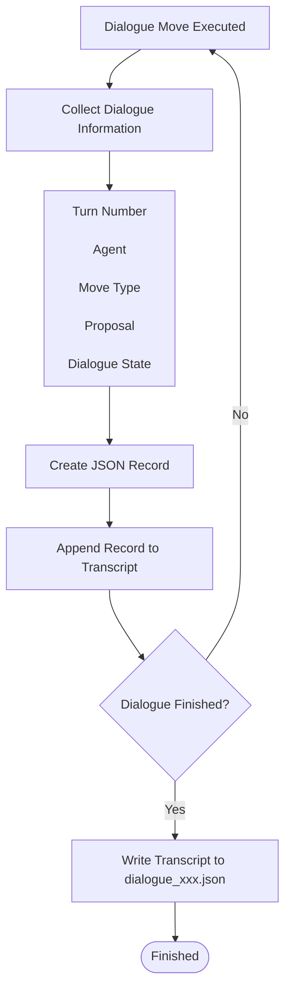

```mermaid
flowchart TD

    A[Dialogue Move Executed]

    B[Collect Dialogue Information]

    C[
        Turn Number<br/>
        Agent<br/>
        Move Type<br/>
        Proposal<br/>
        Dialogue State<br/>
    ]

    D[Create JSON Record]

    E[Append Record to Transcript]

    F{Dialogue Finished?}

    G[Write Transcript to dialogue_xxx.json]

    H([Finished])

    A --> B
    B --> C
    C --> D
    D --> E
    E --> F

    F -- No --> A
    F -- Yes --> G
    G --> H
```