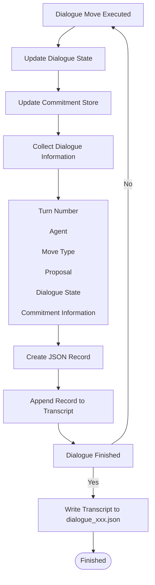

```mermaid
flowchart TD

    A[Dialogue Move Executed]

    B[Update Dialogue State]

    C[Update Commitment Store]

    D[Collect Dialogue Information]

    E[
        Turn Number<br/>
        Agent<br/>
        Move Type<br/>
        Proposal<br/>
        Dialogue State<br/>
        Commitment Information
    ]

    F[Create JSON Record]

    G[Append Record to Transcript]

    H[Dialogue Finished]

    I[Write Transcript to dialogue_xxx.json]

    J([Finished])

    A --> B
    B --> C
    C --> D
    D --> E
    E --> F
    F --> G
    G --> H

    H -- No --> A
    H -- Yes --> I
    I --> J
```